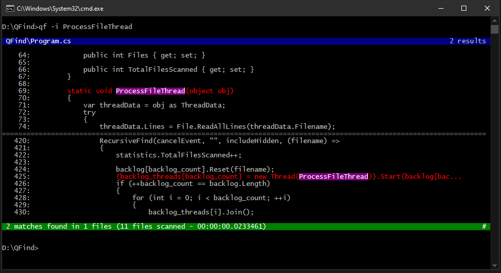
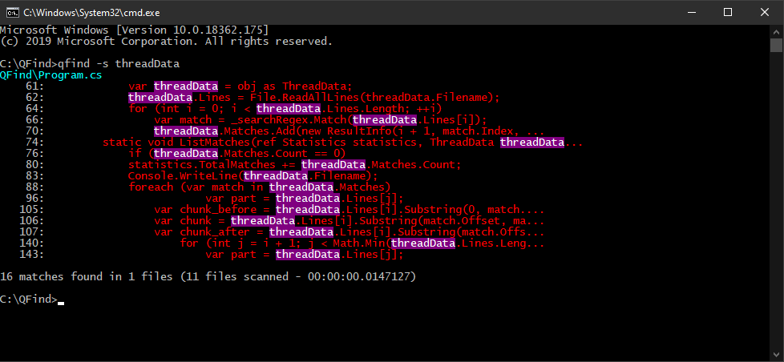

# QFind

QFind "Quick Finder" is a console tool to search in files. It is designed to be used alongside a big code project.



It uses multiple threads to scan through files using the provided Regex search string.

## Usage
`qfind.exe -i "regex"`

The parameter `-i` stands for case-insensitive regex search.

The default extensions it search through are the following:
- Text files (.txt)
- Code files (.cpp, .c, .h, .inl, .cs)
- Script files (.lua, .py, .js, .ts)
- Other formats (.inc, .cfg, .ini, .json, .csv, .html, .cshtml, .css)

The parameter `--ext` can be used to override the extensions:

`qfind.exe --ext "cpp,h" -i "regex"`

The tool can also be used with more complex regex that cannot be entered on command line, for example ones with double quotes ("):

```
C:\> qfind.exe -i
Find regex> something\s*=\s*"\.*+"
```

By default QFind will ignore hidden files and folders. This can be overriden by passing the `-a` argument.

`qfind.exe -a -i test`

A simplified result view can be achieved with the `-s` argument. This view does not display surrounding lines, which provides a compact view if there are a lot of results.

`qfind -s threadData`

